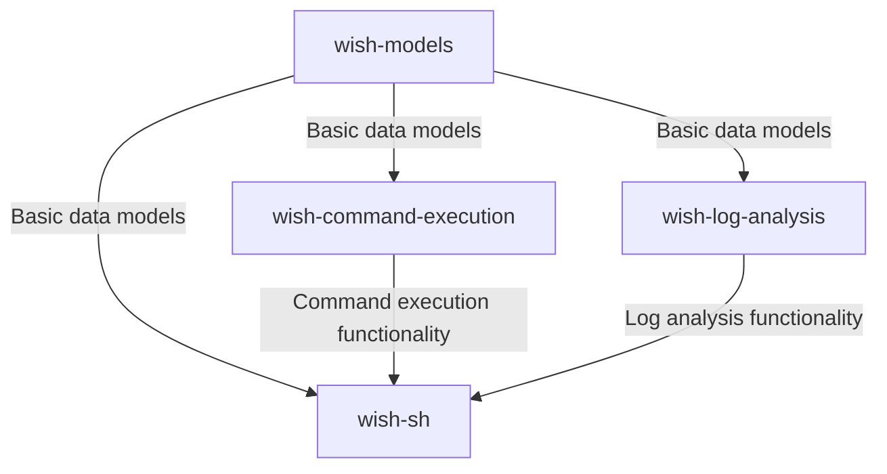
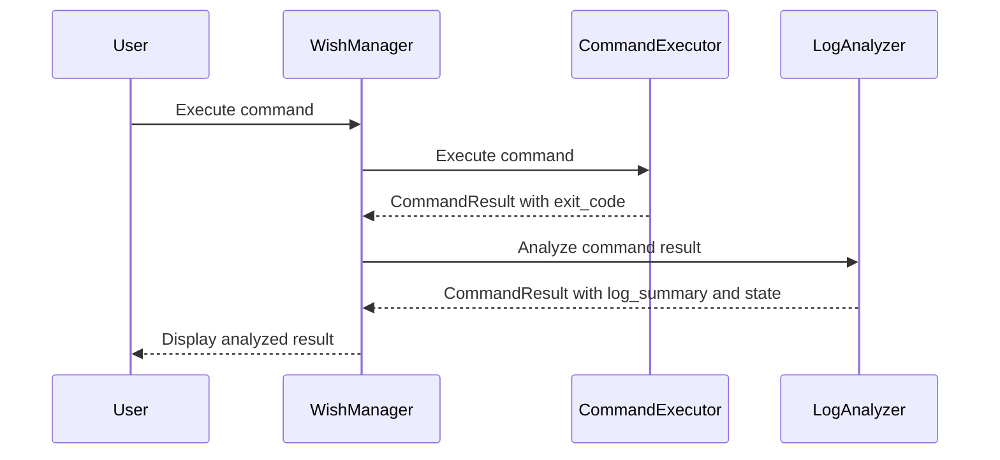

# wish-sh - Design Documentation

## System Architecture

wish-sh consists of four main packages, each with clear responsibilities:

### Package Dependencies

- **wish-models**: No external dependencies except for pydantic
- **wish-command-execution**: Depends on wish-models
- **wish-log-analysis**: Depends on wish-models, langchain, and OpenAI
- **wish-sh**: Depends on wish-models, wish-command-execution, and wish-log-analysis

## Package Descriptions

### wish-models

Core data models used throughout the system. This package defines:

- Command result models
- Wish state models
- UTC datetime utilities
- Test factories for model instances

The models are implemented using Pydantic for validation and serialization.

### wish-command-execution

Handles the execution of shell commands and tracks their status. Key features:

- Command execution in subprocesses
- Status tracking and updates
- Log file management
- Error handling and recovery

### wish-log-analysis

Analyzes command execution logs and classifies command states. Key features:

- Log summarization using LLM
- Command state classification based on exit code, stdout, and stderr
- LangGraph-based analysis pipeline
- Integration with OpenAI API

### wish-sh

Provides the TUI (Text-based User Interface) for user interaction. Key components:

- WishManager: Coordinates between UI, command execution, and log analysis
- TUI Screens: Input, suggestion, and execution screens
- Command generation (currently mock, will be LLM-based)
- User interaction handling

## Responsibility Separation

The system follows a clear separation of responsibilities between packages:

### wish-command-execution

- **Responsibility**: Execute commands and capture basic execution results
- **Outputs**:
  - Sets `exit_code` in CommandResult
  - May set `state` for clear cases (e.g., USER_CANCELLED)
  - Does NOT set `log_summary` (leaves it as None)

### wish-log-analysis

- **Responsibility**: Analyze command logs and provide detailed insights
- **Outputs**:
  - Sets `log_summary` in CommandResult
  - Sets `state` if not already set by wish-command-execution
  - Provides detailed classification of command results

This separation allows each package to focus on its core functionality:
- wish-command-execution focuses on the mechanics of command execution
- wish-log-analysis focuses on the interpretation and analysis of command results

## Data Flow

1. User inputs a wish in the TUI
2. WishManager processes the wish and generates commands
3. User confirms the commands
4. CommandExecutor executes the commands and sets basic result information (exit_code)
5. LogAnalyzer analyzes the command results and sets detailed information (log_summary, state)
6. Status updates are tracked and displayed in the TUI
7. Results are stored in the wish history

## Command Result Processing Flow

## Future Enhancements

- Integration with a real LLM for command generation
- Enhanced error handling and recovery
- Improved log summarization using AI
- Command templates for common tasks
- Multi-step workflows
