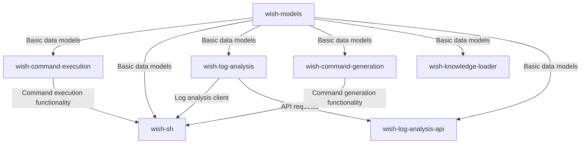
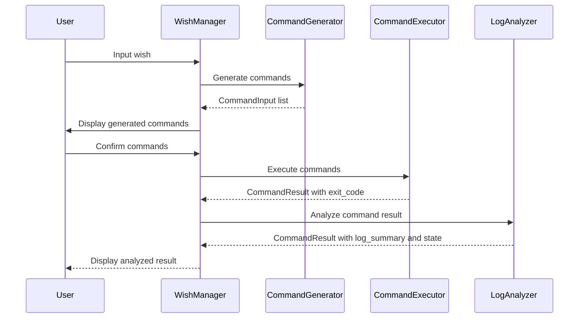

# wish-sh - Design Documentation

## System Architecture

wish-sh consists of seven main packages, each with clear responsibilities:

### Package Dependencies

- **wish-models**: No external dependencies except for pydantic
- **wish-command-execution**: Depends on wish-models
- **wish-log-analysis**: Depends on wish-models and makes API requests to wish-log-analysis-api
- **wish-log-analysis-api**: Depends on wish-models, langchain, and OpenAI
- **wish-command-generation**: Depends on wish-models, langchain, and OpenAI
- **wish-knowledge-loader**: Depends on langchain and OpenAI
- **wish-sh**: Depends on wish-models, wish-command-execution, wish-log-analysis, and wish-command-generation

## Package Descriptions

### wish-models

Core data models used throughout the system. This package defines:

- Command result models
- Wish state models
- UTC datetime utilities
- Test factories for model instances

The models are implemented using Pydantic for validation and serialization.

### wish-command-execution

Handles the execution of shell commands and tracks their status. Key features:

- Command execution in subprocesses
- Status tracking and updates
- Log file management
- Error handling and recovery

### wish-log-analysis

Acts as a client library that interfaces with the wish-log-analysis-api service to analyze command execution logs. Key features:

- Provides LogAnalysisClient to send HTTP requests to the wish-log-analysis-api service
- Sends command execution results (CommandResult) to the API and retrieves analysis results
- Provides a simplified interface for use by wish-sh

### wish-log-analysis-api

Provides an API server for analyzing command execution logs. Key features:

- API endpoint implemented as an AWS Lambda function
- LangGraph-based analysis pipeline
- Log summarization
- Command state classification based on exit code, stdout, and stderr
- Generation and return of analysis results
- Integration with OpenAI API

### wish-command-generation

Generates shell commands from natural language wishes using LLM. Key features:

- RAG (Retrieval-Augmented Generation) for improved command accuracy
- LangGraph-based generation pipeline
- Integration with OpenAI API
- Command generation with context from knowledge bases

### wish-knowledge-loader

CLI tool for loading knowledge bases into wish. Key features:

- Clones GitHub repositories
- Extracts content from specified files
- Stores content in a vector database for RAG
- Search functionality for knowledge bases

### wish-sh

Provides the TUI (Text-based User Interface) for user interaction. Key components:

- WishManager: Coordinates between UI, command execution, log analysis, and command generation
- TUI Screens: Input, suggestion, and execution screens
- User interaction handling

## Responsibility Separation

The system follows a clear separation of responsibilities between packages:

### wish-command-execution

- **Responsibility**: Execute commands and capture basic execution results
- **Outputs**:
  - Sets `exit_code` in CommandResult
  - May set `state` for clear cases (e.g., USER_CANCELLED)
  - Does NOT set `log_summary` (leaves it as None)

### wish-log-analysis

- **Responsibility**: Analyze command logs and provide detailed insights
- **Outputs**:
  - Sets `log_summary` in CommandResult
  - Sets `state` if not already set by wish-command-execution
  - Provides detailed classification of command results

### wish-command-generation

- **Responsibility**: Generate commands from natural language wishes
- **Outputs**:
  - Generates a list of CommandInput objects
  - Uses RAG to improve command accuracy
  - Handles error cases and provides fallback commands

### wish-knowledge-loader

- **Responsibility**: Manage knowledge bases for RAG
- **Outputs**:
  - Creates and maintains vector databases of knowledge
  - Provides search functionality for knowledge bases

This separation allows each package to focus on its core functionality.

## Data Flow

1. User inputs a wish in the TUI
2. WishManager passes the wish to the CommandGenerator
3. CommandGenerator uses RAG to retrieve relevant knowledge and generate commands
4. User confirms the commands
5. CommandExecutor executes the commands and sets basic result information (exit_code)
6. LogAnalyzer analyzes the command results and sets detailed information (log_summary, state)
7. Status updates are tracked and displayed in the TUI
8. Results are stored in the wish history

## Detailed Command Flow

The following flowchart shows the complete end-to-end process from user input to command execution and analysis:

```mermaid
flowchart TB
    %% User Interface Layer
    subgraph TUI["🖥️ Terminal User Interface (wish-sh)"]
        A[User launches wish shell] --> B[WishApp initializes]
        B --> C[System Info Collection]
        C --> D[WishInput Screen]
        D --> E["User enters wish:<br/>'scan all ports on target'"]
    end

    %% Wish Management Layer
    subgraph WM["📋 Wish Management"]
        E --> F[WishManager.generate_commands]
        F --> G[Create Wish object]
        G --> H[CommandGenerator client]
    end

    %% Command Generation API Layer
    subgraph API["🤖 Command Generation API"]
        H --> I[API Request with context]
        I --> J[LangGraph State Machine]
        
        subgraph Graph["Command Generation Graph"]
            J --> K[feedback_analyzer]
            K --> L{Route by feedback}
            L -->|First execution| M[query_processor]
            L -->|Timeout error| N[timeout_handler]
            L -->|Network error| O[network_error_handler]
            
            M --> P[command_generator]
            N --> Q[command_modifier]
            O --> Q
            P --> Q
            Q --> R[result_formatter]
        end
        
        subgraph LLM["LLM Processing"]
            P --> S["ChatGPT/OpenAI<br/>with prompt template"]
            S --> T["Generated command:<br/>'nmap -p1-1000 $TARGET_IP'<br/>'nmap -p1001-2000 $TARGET_IP'<br/>..."]
        end
    end

    %% Command Suggestion Layer
    subgraph CS["✅ Command Suggestion"]
        R --> U[Return commands list]
        U --> V[CommandSuggestion Screen]
        V --> W["Display commands<br/>for user approval"]
        W --> X{User decision}
        X -->|Yes| Y[Proceed to execution]
        X -->|No| D
    end

    %% Command Execution Layer
    subgraph CE["⚡ Command Execution"]
        Y --> Z[CommandExecutionScreen]
        Z --> AA[CommandExecutor]
        AA --> AB[Backend selection]
        
        AB --> AC{Backend type}
        AC -->|Local| AD[BashBackend]
        AC -->|Remote| AE[SliverBackend]
        
        AD --> AF[Execute via subprocess]
        AE --> AG[Execute via C2]
        
        AF --> AH[Write stdout/stderr<br/>to log files]
        AG --> AH
    end

    %% Monitoring Layer
    subgraph MON["📊 Monitoring & Analysis"]
        AH --> AI[CommandStatusTracker]
        AI --> AJ[Monitor execution]
        AJ --> AK{Command complete?}
        AK -->|No| AJ
        AK -->|Yes| AL[LogAnalysisClient]
        AL --> AM[Analyze logs with LLM]
        AM --> AN[Update command state]
        AN --> AO[Update UI status]
    end

    %% Completion
    AO --> AP{All commands done?}
    AP -->|No| AJ
    AP -->|Yes| AQ[Update Wish state]
    AQ --> AR[Show completion message]
    AR --> AS[Return to WishInput]
    AS --> D

    %% Styling
    classDef userAction fill:#e1f5fe,stroke:#01579b,stroke-width:2px
    classDef llmAction fill:#f3e5f5,stroke:#4a148c,stroke-width:2px
    classDef systemAction fill:#e8f5e9,stroke:#1b5e20,stroke-width:2px
    classDef decision fill:#fff3e0,stroke:#e65100,stroke-width:2px
    
    class E,W,X userAction
    class S,AM llmAction
    class F,G,H,I,J,K,M,N,O,P,Q,R,U,V,Y,Z,AA,AB,AD,AE,AF,AG,AH,AI,AJ,AL,AN,AO,AQ,AR systemAction
    class L,X,AC,AK,AP decision
```

## Command Result Processing Flow

## Key Components and Their Roles

### 1. **wish-sh (TUI Interface)**
- **Entry Point**: `wish.py` - Handles CLI arguments and initializes the TUI
- **Main App**: `WishApp` in `wish_tui.py` - Manages the Textual-based interface
- **Screens**:
  - `WishInput`: Where users type their natural language wishes
  - `CommandSuggestion`: Shows generated commands for approval
  - `CommandExecutionScreen`: Displays real-time execution status

### 2. **WishManager**
- Central orchestrator in `wish_manager.py`
- Coordinates between command generation, execution, and analysis
- Manages wish lifecycle and persistence

### 3. **Command Generation API**
- **Client**: `CommandGenerationClient` sends requests to the API
- **API Handler**: Lambda function processes requests
- **LangGraph**: State machine with specialized nodes:
  - `feedback_analyzer`: Handles retry logic for failed commands
  - `query_processor`: Prepares the query for LLM
  - `command_generator`: Uses OpenAI/ChatGPT with prompt templates
  - `command_modifier`: Applies transformations (e.g., divide & conquer)
  - `result_formatter`: Prepares the final command list

### 4. **LLM Prompt Templates**
The system uses sophisticated prompts that include:
- **Context Information**: Current directory, command history
- **Guidelines**: 
  - Interactive command avoidance (e.g., `msfconsole -x "...exit -y"`)
  - Fast alternatives (e.g., using `rg` instead of `grep`)
  - Divide & conquer strategies (e.g., splitting port scans)

### 5. **Command Execution**
- **CommandExecutor**: Manages command lifecycle
- **Backends**:
  - `BashBackend`: Local execution via subprocess
  - `SliverBackend`: Remote execution via C2 framework
- **Logging**: All output captured to files for analysis

### 6. **Monitoring & Analysis**
- **CommandStatusTracker**: Polls for command completion
- **LogAnalysisClient**: Uses LLM to analyze command output
- **State Management**: Tracks success, failure, timeouts, etc.

## Example Flow

**User's Wish**: "scan all ports on the target machine"

1. User types wish in TUI
2. WishManager creates Wish object with unique ID
3. CommandGenerator sends to API with system context
4. LangGraph processes through nodes:
   - Query processor enhances the query
   - Command generator creates base command
   - Command modifier applies divide & conquer (splits into 65 parallel nmap commands)
5. User sees suggested commands and approves
6. CommandExecutor runs all commands in parallel
7. StatusTracker monitors progress
8. LogAnalysisClient analyzes results
9. UI updates with findings
10. User returns to wish input for next task

## Key Design Patterns

1. **State Machine Pattern**: LangGraph for complex command generation logic
2. **Strategy Pattern**: Multiple execution backends (Bash, Sliver)
3. **Observer Pattern**: Real-time UI updates during execution
4. **Chain of Responsibility**: Node-based processing in command generation

## Integration Points

- **LangSmith**: Tracing for LLM operations
- **OpenAI API**: Command generation and log analysis
- **Sliver C2**: Remote command execution
- **File System**: Log storage and analysis
