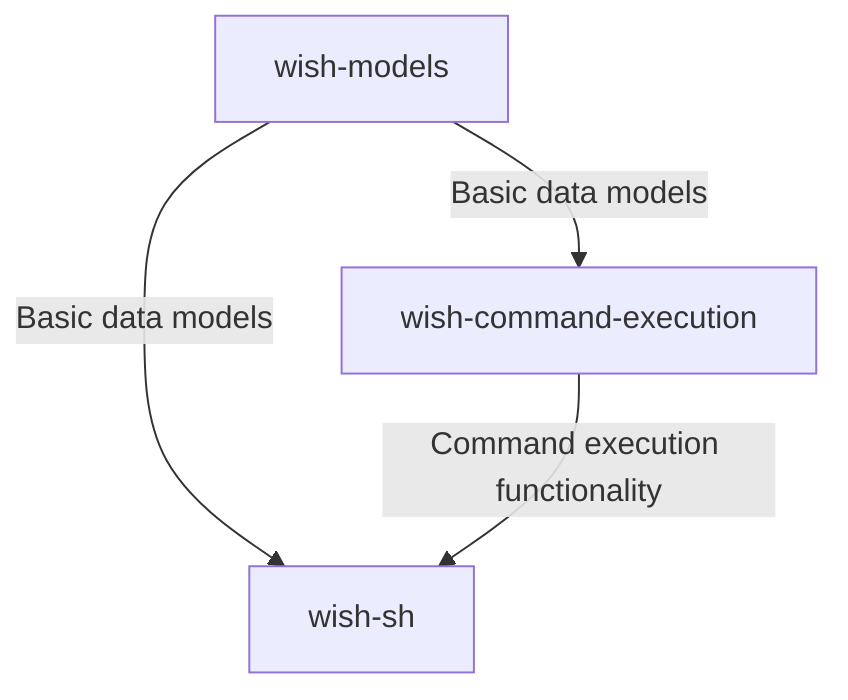

# wish-sh - Design Documentation

## System Architecture

wish-sh consists of three main packages, each with clear responsibilities:

### Package Dependencies

- **wish-models**: No external dependencies except for pydantic
- **wish-command-execution**: Depends on wish-models
- **wish-sh**: Depends on wish-models and wish-command-execution

## Package Descriptions

### wish-models

Core data models used throughout the system. This package defines:

- Command result models
- Wish state models
- UTC datetime utilities
- Test factories for model instances

The models are implemented using Pydantic for validation and serialization.

### wish-command-execution

Handles the execution of shell commands and tracks their status. Key features:

- Command execution in subprocesses
- Status tracking and updates
- Log file management
- Error handling and recovery

### wish-sh

Provides the TUI (Text-based User Interface) for user interaction. Key components:

- WishManager: Coordinates between UI and command execution
- TUI Screens: Input, suggestion, and execution screens
- Command generation (currently mock, will be LLM-based)
- User interaction handling

## Data Flow

1. User inputs a wish in the TUI
2. WishManager processes the wish and generates commands
3. User confirms the commands
4. CommandExecutor executes the commands
5. Status updates are tracked and displayed in the TUI
6. Results are stored in the wish history

## Future Enhancements

- Integration with a real LLM for command generation
- Enhanced error handling and recovery
- Improved log summarization using AI
- Command templates for common tasks
- Multi-step workflows
