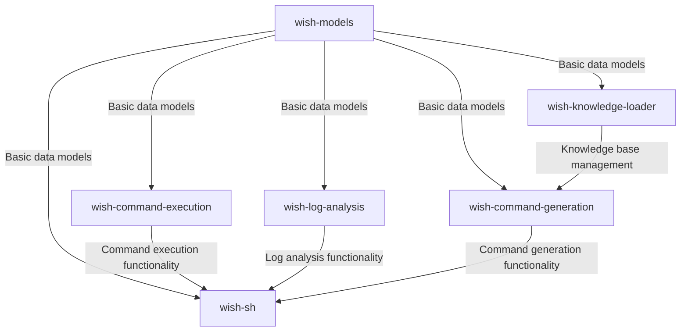
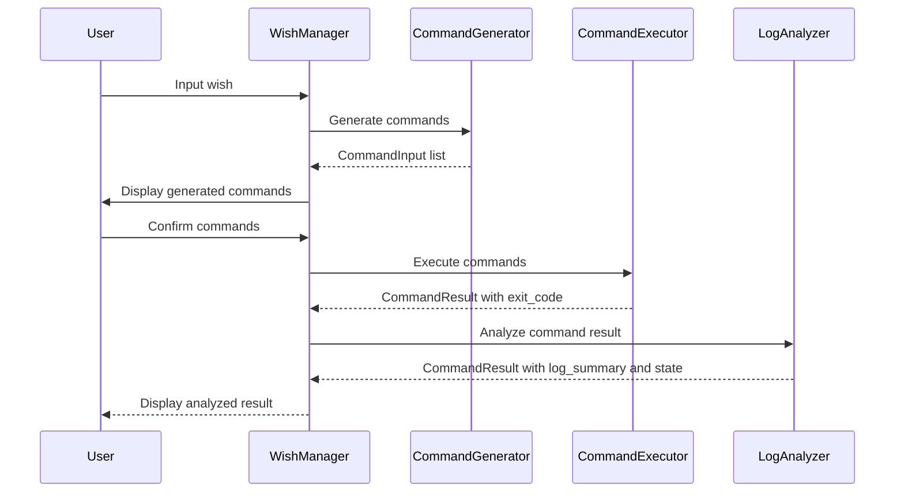

# wish-sh - Design Documentation

## System Architecture

wish-sh consists of six main packages, each with clear responsibilities:

### Package Dependencies

- **wish-models**: No external dependencies except for pydantic
- **wish-command-execution**: Depends on wish-models
- **wish-log-analysis**: Depends on wish-models, langchain, and OpenAI
- **wish-command-generation**: Depends on wish-models, langchain, and OpenAI
- **wish-knowledge-loader**: Depends on langchain and OpenAI
- **wish-sh**: Depends on wish-models, wish-command-execution, wish-log-analysis, and wish-command-generation

## Package Descriptions

### wish-models

Core data models used throughout the system. This package defines:

- Command result models
- Wish state models
- UTC datetime utilities
- Test factories for model instances

The models are implemented using Pydantic for validation and serialization.

### wish-command-execution

Handles the execution of shell commands and tracks their status. Key features:

- Command execution in subprocesses
- Status tracking and updates
- Log file management
- Error handling and recovery

### wish-log-analysis

Analyzes command execution logs and classifies command states. Key features:

- Log summarization using LLM
- Command state classification based on exit code, stdout, and stderr
- LangGraph-based analysis pipeline
- Integration with OpenAI API

### wish-command-generation

Generates shell commands from natural language wishes using LLM. Key features:

- RAG (Retrieval-Augmented Generation) for improved command accuracy
- LangGraph-based generation pipeline
- Integration with OpenAI API
- Command generation with context from knowledge bases

### wish-knowledge-loader

CLI tool for loading knowledge bases into wish. Key features:

- Clones GitHub repositories
- Extracts content from specified files
- Stores content in a vector database for RAG
- Search functionality for knowledge bases

### wish-sh

Provides the TUI (Text-based User Interface) for user interaction. Key components:

- WishManager: Coordinates between UI, command execution, log analysis, and command generation
- TUI Screens: Input, suggestion, and execution screens
- User interaction handling

## Responsibility Separation

The system follows a clear separation of responsibilities between packages:

### wish-command-execution

- **Responsibility**: Execute commands and capture basic execution results
- **Outputs**:
  - Sets `exit_code` in CommandResult
  - May set `state` for clear cases (e.g., USER_CANCELLED)
  - Does NOT set `log_summary` (leaves it as None)

### wish-log-analysis

- **Responsibility**: Analyze command logs and provide detailed insights
- **Outputs**:
  - Sets `log_summary` in CommandResult
  - Sets `state` if not already set by wish-command-execution
  - Provides detailed classification of command results

### wish-command-generation

- **Responsibility**: Generate commands from natural language wishes
- **Outputs**:
  - Generates a list of CommandInput objects
  - Uses RAG to improve command accuracy
  - Handles error cases and provides fallback commands

### wish-knowledge-loader

- **Responsibility**: Manage knowledge bases for RAG
- **Outputs**:
  - Creates and maintains vector databases of knowledge
  - Provides search functionality for knowledge bases

This separation allows each package to focus on its core functionality.

## Data Flow

1. User inputs a wish in the TUI
2. WishManager passes the wish to the CommandGenerator
3. CommandGenerator uses RAG to retrieve relevant knowledge and generate commands
4. User confirms the commands
5. CommandExecutor executes the commands and sets basic result information (exit_code)
6. LogAnalyzer analyzes the command results and sets detailed information (log_summary, state)
7. Status updates are tracked and displayed in the TUI
8. Results are stored in the wish history

## Command Result Processing Flow

## Future Enhancements

- Robust command generation (NETWORK_ERROR, TIMEOUT handling)
- Command modification capabilities
- Additional knowledge bases for RAG
- English prompt support
- API client/server architecture
- Enhanced error handling and recovery
- Improved log summarization using AI
- Command templates for common tasks
- Multi-step workflows
