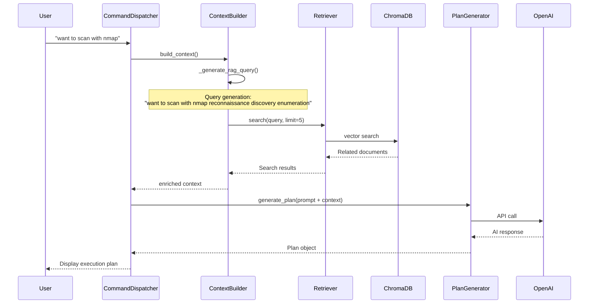

# HackTricks RAG Search Flow Details

## Overview

wish leverages the HackTricks knowledge base to enhance LLM prompts based on user natural language input. This document explains the detailed flow and practical examples.

## 1. Overall Flow



## 2. Query Generation Details

### 2.1 _generate_rag_query() Logic

```python
def _generate_rag_query(self, user_input: str, engagement_state: EngagementState) -> str:
    query_parts = [user_input]  # "want to scan with nmap"
    
    # Add mode-specific keywords
    mode_keywords = {
        "recon": ["reconnaissance", "discovery", "enumeration"],
        "enum": ["enumeration", "scanning", "service detection"],
        "exploit": ["exploitation", "vulnerability", "payload"],
    }
    
    current_mode = engagement_state.get_current_mode()  # "recon"
    if current_mode in mode_keywords:
        query_parts.extend(mode_keywords[current_mode])
    
    # Add keywords from discovered services
    active_hosts = engagement_state.get_active_hosts()
    for host in active_hosts[:3]:
        for service in host.services:
            if service.state == "open" and service.service_name:
                query_parts.append(service.service_name)  # "http", "ssh", etc.
                
    return " ".join(query_parts[:10])
```

### 2.2 Actual Query Examples

**User Input**: "want to scan with nmap"  
**Current Mode**: recon  
**Discovered Services**: None (initial scan)

**Generated Query**:
```
"want to scan with nmap reconnaissance discovery enumeration"
```

**Another Example (when hosts are already discovered)**:  
**User Input**: "want to check web application vulnerabilities"  
**Current Mode**: enum  
**Discovered Services**: http (80), https (443), ssh (22)

**Generated Query**:
```
"want to check web application vulnerabilities enumeration scanning service detection http https web application ssh"
```

## 3. Search Result Examples

### 3.1 ChromaDB Search Result Format

```json
{
  "results": [
    {
      "title": "Network Scanning - HackTricks",
      "content": "# Network Scanning\n\n## Nmap Basic Commands\n\nBasic network discovery:\n```bash\nnmap -sn 192.168.1.0/24  # Ping scan\nnmap -sS -p- 192.168.1.1  # SYN scan all ports\n```\n\nService detection:\n```bash\nnmap -sV -sC -O target  # Version, scripts, OS detection\n```",
      "score": 0.92,
      "source": "HackTricks",
      "metadata": {
        "category": "methodology",
        "has_code": true,
        "url": "https://book.hacktricks.xyz/pentesting/pentesting-network/network-scanning"
      }
    },
    {
      "title": "Port Scanning Techniques",
      "content": "## Advanced Nmap Techniques\n\nTiming and performance:\n```bash\nnmap -T4 -F target  # Fast scan, common ports\nnmap -T1 -p 80,443 target  # Slow scan, specific ports\n```",
      "score": 0.87,
      "source": "HackTricks"
    }
  ],
  "query": "want to scan with nmap reconnaissance discovery enumeration",
  "total_results": 5
}
```

### 3.2 Tool Information Search (from tools.tsv)

```python
# Result from HackTricksRetriever.get_tools_for_context()
[
    ToolInfo(
        name="nmap",
        category="network_scan",
        description="Network exploration tool and security scanner",
        example_commands=[
            "nmap -sn 192.168.1.0/24",
            "nmap -sV -sC -O -T4 target",
            "nmap -p 80,443 --script http-enum target"
        ],
        platforms=["linux", "windows", "macos"],
        confidence=0.95,
        source_url="https://book.hacktricks.xyz/pentesting/pentesting-network/nmap"
    ),
    ToolInfo(
        name="masscan",
        category="network_scan",
        description="Fast port scanner",
        example_commands=["masscan -p1-65535 10.0.0.0/8 --rate=1000"],
        confidence=0.85
    )
]
```

## 4. Context Building

### 4.1 ContextBuilder.build_context() Output

```json
{
  "user_input": "want to scan with nmap",
  "mode": "recon",
  "timestamp": "2024-01-20T10:30:00",
  "knowledge": {
    "articles": [
      {
        "title": "Network Scanning - HackTricks",
        "content": "# Network Scanning\n\n## Nmap Basic Commands\n\nBasic network discovery:\n```bash\nnmap -sn 192.168.1.0/24  # Ping scan...",
        "score": 0.92,
        "source": "HackTricks"
      }
    ],
    "query": "want to scan with nmap reconnaissance discovery enumeration",
    "total_results": 5
  },
  "state": {
    "mode": "recon",
    "targets_count": 1,
    "in_scope_targets": 1,
    "active_hosts_count": 0,
    "open_services_count": 0,
    "findings_count": 0,
    "severity_counts": {},
    "common_services": {},
    "phase": "initial_reconnaissance"
  },
  "conversation": {
    "messages": [],
    "summary": "No previous conversation",
    "total_messages": 0
  }
}
```

## 5. Final LLM Prompt

### 5.1 PlanGenerator._build_plan_prompt() Generated Result

```
You are WISH, an AI-powered penetration testing assistant. Generate a structured plan based on the user's request.

## Current Context

**Mode**: recon
**Current Phase**: initial_reconnaissance

**Targets**:
- 192.168.1.0/24 (network)

**Discovered Hosts**: None

**Findings**: None yet

## User Request

want to scan with nmap

## Knowledge Base Context

Based on HackTricks knowledge base, here are relevant techniques:

### Network Scanning - HackTricks
Basic network discovery:
```bash
nmap -sn 192.168.1.0/24  # Ping scan
nmap -sS -p- 192.168.1.1  # SYN scan all ports
```

Service detection:
```bash
nmap -sV -sC -O target  # Version, scripts, OS detection
```

### Recommended Tools
- nmap: Network exploration tool and security scanner (confidence: 0.95)
- masscan: Fast port scanner (confidence: 0.85)

## Instructions

Generate a penetration testing plan as a JSON object with the following structure:

```json
{
    "description": "Brief description of what this plan accomplishes",
    "rationale": "Explanation of why this approach was chosen",
    "estimated_duration": 30,
    "steps": [
        {
            "tool_name": "nmap",
            "command": "nmap -sV -sC -O -T4 --max-retries 2 target",
            "purpose": "Detailed service and OS detection",
            "expected_result": "Service versions and OS information",
            "risk_level": "low",
            "timeout": 120,
            "requires_confirmation": false
        }
    ]
}
```

[Tool list and guidelines continue...]
```

### 5.2 HackTricks Knowledge Integration

The prompt integrates HackTricks knowledge as follows:

1. **Specific Command Examples**
   - Actual nmap commands extracted from search results
   - Timing options and scan type recommendations

2. **Tool Recommendations**
   - Related tools from tools.tsv
   - Prioritized with confidence scores

3. **Context-Aware Techniques**
   - Methods suitable for current phase (reconnaissance)
   - Next steps based on discovered services

## 6. Practical Usage Examples

### Example 1: Initial Scan

**User Input**: "scan the target network"

**RAG Query**:
```
"scan the target network reconnaissance discovery enumeration"
```

**Knowledge from Search Results**:
- Basic network discovery commands
- Recommended scan order (ping scan → port scan → service scan)
- Timing optimization hints

**Generated Plan**:
```json
{
  "description": "Comprehensive scan of target network",
  "rationale": "Using phased scanning approach based on HackTricks best practices",
  "steps": [
    {
      "tool_name": "nmap",
      "command": "nmap -sn 192.168.1.0/24",
      "purpose": "Host discovery (Ping scan)"
    },
    {
      "tool_name": "nmap", 
      "command": "nmap -sS -p- -T4 --max-retries 2 192.168.1.1-10",
      "purpose": "SYN scan all ports"
    }
  ]
}
```

### Example 2: Service-Specific Investigation

**User Input**: "want to check SMB vulnerabilities"  
**Discovered Services**: SMB (445), NetBIOS (139)

**RAG Query**:
```
"want to check SMB vulnerabilities enumeration scanning service detection smb"
```

**Knowledge from Search Results**:
- SMB enumeration techniques
- enum4linux usage
- smbclient command examples
- Known SMB vulnerabilities (MS17-010, etc.)

**Enhanced Prompt Section**:
```
### SMB Enumeration - HackTricks
SMB enumeration commands:
```bash
enum4linux -a target
smbclient -L //target -N
rpcclient -U "" target -N
```

Check for vulnerabilities:
```bash
nmap --script smb-vuln* target
```
```

## 7. Token Allocation

ContextBuilder allocates tokens as follows:

```python
self.token_allocation = {
    "system_prompt": 1000,       # Basic instructions
    "knowledge_context": 1500,   # HackTricks search results
    "state_summary": 1500,       # Current state
    "conversation_history": 2000, # Conversation history
    "user_input": 500,          # User input
    "response_buffer": 1500,    # Response buffer
}
```

Total: 8000 tokens (within standard OpenAI API limits)

## 8. Key Points for Effective Usage

### 8.1 Query Optimization
- Expand queries with mode and service information even for ambiguous user input
- Limit to maximum 10 keywords to maintain search accuracy

### 8.2 Search Result Prioritization
- Ranking by score
- Prioritize content relevant to current phase
- Emphasize articles with code examples

### 8.3 Context Compression
- Limit search results to first 500 characters
- Prioritize important parts (command examples)
- Provide additional information through metadata

## Summary

wish's RAG search flow achieves effective AI assistance through:

1. **Dynamic Query Generation**: Combining user input with system state
2. **Dual Storage Utilization**: Vector search (ChromaDB) and structured data (tools.tsv)
3. **Context Optimization**: Providing maximum information within token limits
4. **Phased Knowledge Integration**: Search → Filtering → Summarization → Prompt generation

This enables the LLM to generate more accurate and practical penetration testing plans by leveraging HackTricks' practical knowledge.