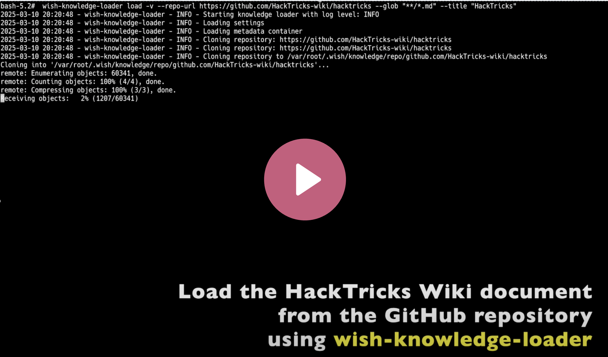

# Knowledge Loader Usage Guide

This guide explains how to use `wish-knowledge-loader` to enhance wish-sh with domain-specific knowledge from GitHub repositories.

[](https://youtube.com/watch?v=euB21uE1naI)

## Overview

The wish-knowledge-loader is a tool that allows you to load, list, and manage knowledge bases from GitHub repositories for use with wish-sh. This knowledge is then used to improve command suggestions through Retrieval-Augmented Generation (RAG).

By loading relevant knowledge bases, you can make wish-sh more effective for specific domains or tasks, such as:

- Penetration testing tools and techniques
- System administration tasks
- Development workflows for specific languages or frameworks
- Cloud infrastructure management

## Prerequisites

Before using wish-knowledge-loader, ensure you have:

1. [Installed wish-sh and wish-knowledge-loader](setup.md)
2. Set up the required environment variables (`OPENAI_API_KEY`, `OPENAI_EMBEDDING_MODEL`, `WISH_HOME`)

## Loading a Knowledge Base

To load a knowledge base from a GitHub repository, use the following command:

```bash
wish-knowledge-loader load --repo-url https://github.com/username/repo --glob "**/*.md" --title "Knowledge Base Title"
```

### Parameters

- `--repo-url`: The URL of the GitHub repository to clone
- `--glob`: A glob pattern that specifies which files to include in the knowledge base (e.g., `"**/*.md"` for all Markdown files)
- `--title`: A descriptive title for the knowledge base

### Example

To load a comprehensive penetration testing knowledge base:

```bash
wish-knowledge-loader load --repo-url https://github.com/HackTricks-wiki/hacktricks --glob "**/*.md" --title "HackTricks Wiki"
```

## Listing Knowledge Bases

To view all loaded knowledge bases:

```bash
wish-knowledge-loader list
```

This command displays:
- The title of each knowledge base
- The repository URL
- The glob pattern used
- Creation and update timestamps

### Parameters

- `--verbose` or `-v`: Enable verbose logging
- `--debug` or `-d`: Enable debug logging (even more verbose)

### Example Output

When knowledge bases exist:

```
Found 2 knowledge bases:

- Title: HackTricks Wiki
  Repository: https://github.com/HackTricks-wiki/hacktricks
  Pattern: **/*.md
  Created: 2025-03-01T12:34:56Z
  Updated: 2025-03-01T12:34:56Z

- Title: OSCP Guide
  Repository: https://github.com/0xsyr0/OSCP
  Pattern: README.md
  Created: 2025-03-02T10:11:12Z
  Updated: 2025-03-02T10:11:12Z
```

When no knowledge bases exist:

```
No knowledge bases found.
```

## Deleting Knowledge Bases

To delete a knowledge base when you no longer need it:

```bash
wish-knowledge-loader delete --title "Knowledge Base Title"
```

### Parameters

- `--title`: The title of the knowledge base to delete
- `--force` or `-f`: Skip the confirmation prompt
- `--verbose` or `-v`: Enable verbose logging
- `--debug` or `-d`: Enable debug logging (even more verbose)

### Confirmation and Output

By default, the delete command will prompt for confirmation:

```
Are you sure you want to delete knowledge base 'HackTricks Wiki'? [y/N]:
```

After successful deletion, you'll see:

```
Successfully deleted knowledge base: HackTricks Wiki
```

If you try to delete a non-existent knowledge base:

```
Knowledge base 'Non-existent Knowledge' not found.
```

### Repository Management

When deleting a knowledge base:
- If multiple knowledge bases use the same repository, the repository files are preserved
- The repository is only deleted when removing the last knowledge base that references it
- The vector database for the knowledge base is always deleted

For example, if both "HackTricks Wiki" and "HackTricks Python Code" use the same repository, deleting one will keep the repository intact. The repository is only deleted when the last knowledge base referencing it is removed.

## How It Works

When you run wish-knowledge-loader:

1. It downloads the specified GitHub repository
2. It collects content from files matching the glob pattern
3. It processes and indexes this content
4. It stores the processed information in your `$WISH_HOME` directory
5. wish-command-generation uses this knowledge to suggest better commands

## Using Multiple Knowledge Bases

You can load multiple knowledge bases by running wish-knowledge-loader multiple times with different repositories or glob patterns. Each knowledge base will be stored separately and used by wish-sh when generating commands.

For example:

```bash
# Load HackTricks Wiki knowledge base
wish-knowledge-loader load --repo-url https://github.com/HackTricks-wiki/hacktricks --glob "**/*.md" --title "HackTricks Wiki"

# Load OSCP Guide knowledge base
wish-knowledge-loader load --repo-url https://github.com/0xsyr0/OSCP --glob "README.md" --title "OSCP Guide"

# Load Python files from the same repository as a separate knowledge base
wish-knowledge-loader load --repo-url https://github.com/HackTricks-wiki/hacktricks --glob "**/*.py" --title "HackTricks Python Code"
```

## Verifying Loaded Knowledge Bases

After loading a knowledge base, you can verify that it's being used by wish-sh by:

1. Starting wish-sh
2. Entering a wish related to the knowledge base you loaded
3. Observing the suggested commands, which should now be more accurate and domain-specific

## Example Use Cases

### Penetration Testing

If you've loaded the HackTricks Wiki and OSCP Guide knowledge bases:

```
Wish: Perform a privilege escalation check on a Linux system
```

wish-sh might suggest:

```bash
./linpeas.sh -a | tee linpeas_output.txt
```

### System Administration

If you've loaded a knowledge base about system administration:

```
Wish: Find processes using the most memory and CPU
```

wish-sh might suggest:

```bash
ps aux --sort=-%mem,%cpu | head -n 10
```

## Next Steps

Once you've enhanced wish-sh with relevant knowledge bases, you can:

1. [Explore Command and Control (C2) for Target System Operations](usage-03-C2.md)
2. Create your own knowledge base repositories to share with others
3. Combine multiple knowledge bases for comprehensive command suggestions
