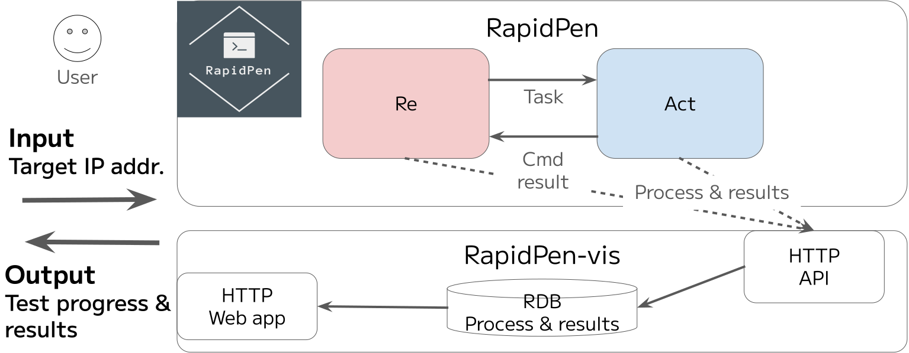
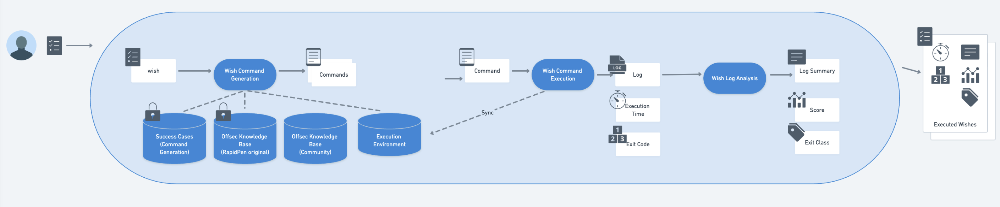
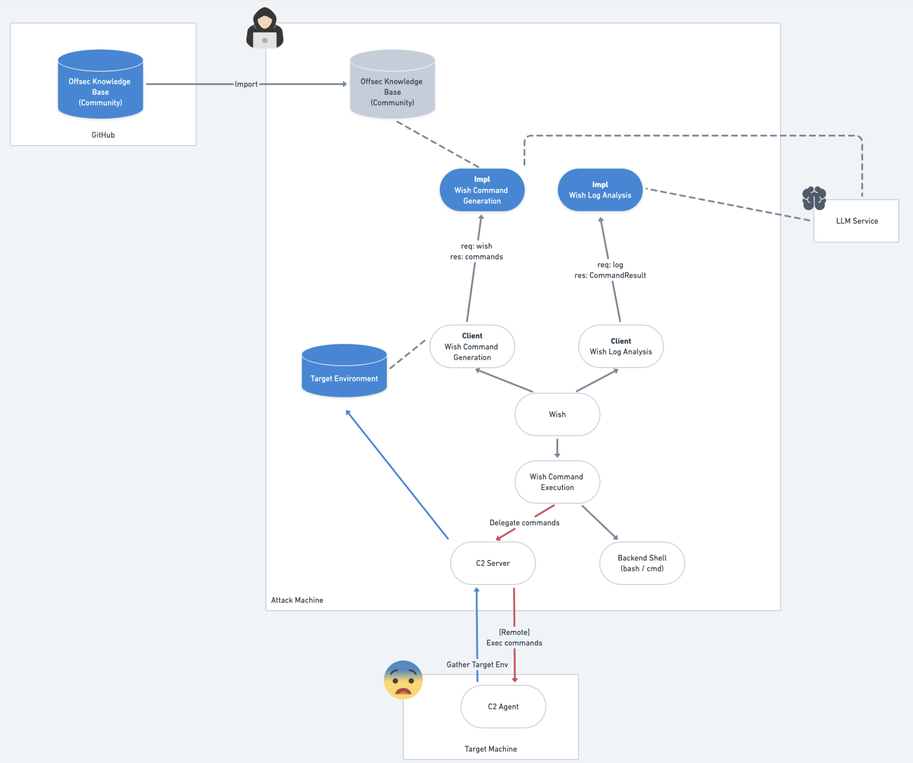
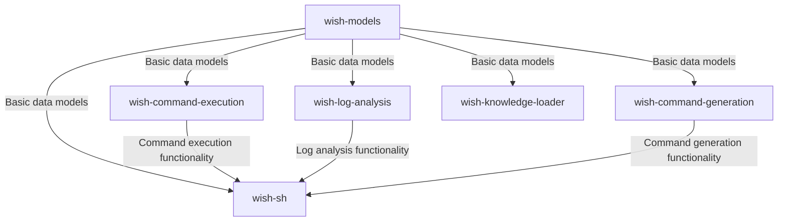
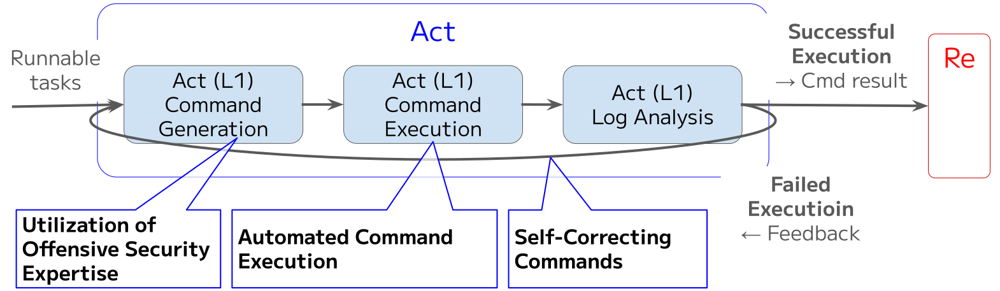

# wish: Your Wish, Our Command

## 1. Introduction

### 1.1 Purpose of this Document

This whitepaper presents "wish," an AI-powered shell environment specifically designed for penetration testing. Operating as an intelligent command-line interface, wish translates natural language inputs into executable shell commands, providing penetration testers with an intuitive and efficient workflow. The document outlines the tool's capabilities, architecture, and potential applications in offensive security operations.

### 1.2 Background and Objectives

#### Beyond Cheatsheets and Copy-Paste

Penetration testing education and practice, whether for OSCP certification, HackTheBox, TryHackMe, or CTF competitions, has traditionally relied heavily on copying and pasting commands from web pages and cheatsheets. While this approach serves an educational purpose, the emergence of Large Language Models (LLMs) presents an opportunity to make this process significantly more intelligent and efficient.

wish was designed to shift the focus from memorizing commands to developing situational awareness and strategic thinking. By simply expressing what needs to be accomplished as a natural language "wish," penetration testers receive contextually appropriate command suggestions, allowing them to concentrate on the higher-level aspects of security assessment rather than syntax details.

#### Accelerating Attack Vector Exploration

Speed is critical in penetration testing, where multiple attack vectors must often be explored to identify viable entry points. Traditional approaches using terminal multiplexers and manual command management can become cumbersome and time-consuming.

wish addresses this challenge by generating multiple commands simultaneously and executing them in parallel and asynchronously. Commands run in the background, with the system providing interruption notifications upon completion. This parallel and asynchronous processing approach allows penetration testers to continue strategizing while commands execute, significantly accelerating the testing workflow.

#### Enhancing Post-Exploitation Experience

Penetration testing extends beyond initial access to include post-exploitation activities. However, shells obtained during this phase are typically limited in functionality, degrading the tester's experience and efficiency. Traditional post-exploitation workflows often force penetration testers to abandon their preferred tools and adapt to restrictive command-line environments.

wish transforms this experience by bringing its AI-powered shell capabilities directly into compromised environments. By integrating with Command and Control (C2) frameworks, wish enables penetration testers to continue using natural language commands even after successful exploitation. This means the same intuitive interface that translates "wishes" into executable commands on your local machine can now operate within the compromised target system. While the current implementation focuses on Sliver C2 integration, the architecture is designed to support various C2 frameworks, including custom solutions, in the future. This flexible integration approach ensures that penetration testers can maintain their efficient, AI-assisted workflow throughout the entire testing process, from initial reconnaissance to post-exploitation.

#### Part of the RapidPen Ecosystem

wish was developed as a component of the RapidPen project [1], an AI-driven system for automated penetration testing. RapidPen's architecture is divided into two main components: "Re" for task planning and "Act" for command execution. The effectiveness of the Act component significantly influences the success of initial access in the RapidPen system.

By extracting the Act component as an open-source tool, wish aims to refine and improve this critical functionality through community involvement. While RapidPen focuses on automation, wish acknowledges the continued importance of human-led penetration testing and serves as an assistant that enhances human capabilities rather than replacing them.

The primary objectives of wish are:

- Reduce cognitive load by translating natural language into executable commands
- Accelerate penetration testing workflows through parallel and asynchronous command execution
- Provide contextually relevant command suggestions based on specialized knowledge bases
- Enable seamless operation in both local and compromised environments
- Support the evolution of the RapidPen ecosystem while enhancing human-led security testing

## 2. Tool Overview

### 2.1 Key Features

- **Natural Language Command Generation**: Translate user "wishes" into executable shell commands
- **Offensive Security-Focused Knowledge Base**: Utilize specialized knowledge bases tailored for offensive security operations
- **Parallel & Asynchronous Command Execution**: Execute and track multiple commands simultaneously in the background, allowing users to continue working while waiting for results
- **Log Analysis and Summarization**: Automatically analyze and summarize command outputs
- **C2 Integration**: Operate within compromised environments through C2 framework integration, currently supporting Sliver C2 with plans for expanded framework support

### 2.2 Use Cases

wish is designed for:

- Professional penetration testers during initial access and post-exploitation phases
- Security students preparing for OSCP certification
- HackTheBox, TryHackMe, or CTF (Boot2Root) players looking to enhance their efficiency

#### For Penetration Testing Professionals

Professional penetration testers can leverage wish to streamline their workflow in time-sensitive engagements. By translating complex requirements into executable commands, wish reduces the cognitive load of recalling specific syntax and options. For example, during an external network assessment, a tester might simply express "scan the target network for web servers with potential vulnerabilities" and receive optimized nmap and vulnerability scanning commands tailored to the specific context.

#### For OSCP Students

OSCP certification candidates often struggle with the transition from guided learning to practical application. wish serves as a bridge by helping students convert their conceptual understanding into practical commands. When faced with a challenge like privilege escalation, students can describe their objective in natural language and receive suggested commands that not only solve the immediate problem but also reinforce learning through exposure to proper command syntax and methodology. It is important to note that while wish is an excellent learning tool during OSCP preparation, AI-assisted tools are not permitted during the actual OSCP examination. Using wish during practice labs helps students build the knowledge and skills they will need to perform independently during the certification exam.

#### For CTF and Challenge Platform Players

HackTheBox, TryHackMe, and CTF players operate under time constraints where efficiency is crucial. wish accelerates the reconnaissance and enumeration phases by generating and executing multiple commands in parallel. For instance, when approaching a new Boot2Root challenge, players can initiate comprehensive enumeration by expressing "perform initial enumeration on this target" and receive a set of parallel commands covering port scanning, service identification, and common vulnerability checks.

### 2.3 Comparison with Similar Tools

#### shell_gpt [2]

shell_gpt is a command-line productivity tool that brings the power of large language models to the terminal. It allows users to generate shell commands from natural language descriptions, helping to reduce the cognitive load of remembering complex syntax and options.

Key features of shell_gpt include:
- Natural language to command translation
- Integration with various shells (bash, zsh, fish)

While shell_gpt excels at general-purpose command assistance, it is not specifically designed for offensive security operations. It typically generates one command at a time, which, while suitable for daily work, can be limiting for the rapid, multi-faceted exploration required in penetration testing scenarios.

wish builds upon this foundation by adding specialized offensive security knowledge bases and parallel command execution capabilities, significantly accelerating the penetration testing workflow.

#### Nebula [3]

Nebula is an AI-powered penetration testing assistant designed specifically for security professionals. Unlike wish which focuses on being a shell environment, Nebula has a broader scope beyond shell operations, covering various aspects of penetration testing. It represents an evolution in offensive security tooling by combining AI capabilities with penetration testing expertise.

Key features of Nebula include:

- Specialized for penetration testing workflows
- Suggestion of next actions based on command results
- Multiple command recommendations
- Offline operation using local models

While it can suggest multiple commands, the execution management of these commands is left to the user. Additionally, Nebula emphasizes offline operation, running models locally on the user's machine without sending data to external APIs.

This design choice enhances security and privacy but comes with limitations:
- Requires significant hardware resources (GPU recommended)
- Limited to local model capabilities (speed and accuracy)

wish addresses these limitations by providing a more focused shell experience with parallel and asynchronous command execution management, C2 integration for operation in compromised environments, and leveraging powerful cloud-based models while maintaining operational security.

#### Comparison Summary

| Feature | wish | shell_gpt | Nebula |
|---------|------|-----------|--------|
| **Primary Purpose** | AI-powered shell for penetration testing | AI-powered shell for general purpose | Penetration testing assistance |
| **Command Generation & Execution** | Multiple commands, parallel & asynchronous execution | Single command, sequential execution | Multiple commands (suggestion only) |
| **Knowledge Base** | GitHub documents (e.g. HackTricks) | None | Internet search & local knowledge base |
| **LLM Model** | OpenAI API | OpenAI API + Local models | Local models |
| **Use in Compromised Environments** | Possible (C2 integration) | Not possible | Not possible |
| **UI** | TUI | CLI | GUI |

### 2.4 Architecture

#### Control and Data Flow

The control and data flow between components illustrates how wish processes user inputs and generates results:

Prior to the main workflow, **wish-knowledge-loader** imports knowledge bases from GitHub repositories and other sources, processing and storing them in vector databases. This import process is performed independently of the command generation workflow and serves as a prerequisite for effective command generation.

The typical workflow follows these steps:

1. User inputs a natural language "wish" in the TUI (**wish-sh**)
2. **wish-sh** passes the wish to **wish-command-generation**
3. **wish-command-generation** uses RAG to retrieve relevant knowledge from the pre-imported knowledge bases (managed by **wish-knowledge-loader**) and generate commands
4. Generated command candidates are displayed to the user for confirmation
5. **wish-command-execution** executes the confirmed commands and sets basic result information
6. **wish-log-analysis** analyzes the command results and sets detailed information
7. Status updates are displayed in the TUI, and results are stored in the wish history

This flow enables users to seamlessly experience the entire process from natural language input to executable commands and analyzed results.

#### Logical Architecture

The logical architecture illustrates not just the components of wish, but where they operate and what they interact with:

This architecture highlights several key aspects of the system's deployment and operation:

- Knowledge bases are imported and stored on the attack machine, where they are accessed by the command generation process
- Command execution interfaces with both local shells (bash, zsh, etc.) and remote C2 servers for compromised environments
- LLM operations rely on external services, currently using OpenAI's API

**Core Components and Their Operational Context:**

The package dependencies illustrate how components interact with each other:

- **wish-models**: Core data models used throughout the system, implemented using Pydantic for validation and serialization
- **wish-command-execution**: Executes commands through local shells or C2 frameworks, enabling operation in both attack machines and compromised targets
- **wish-log-analysis**: Analyzes command outputs using external LLM services (OpenAI), transforming raw outputs into actionable insights
- **wish-command-generation**: Generates commands by querying external LLM services (OpenAI) with context from locally stored knowledge bases
- **wish-knowledge-loader**: Imports and processes knowledge bases from external sources (GitHub repositories), storing them locally on the attack machine
- **wish-sh**: Provides the Text-based User Interface (TUI) that runs on the attack machine, coordinating all other components

This architecture enables wish to operate seamlessly across different environments (local and remote) while leveraging both local resources and external services.

#### Relationship with RapidPen's Act Component

The detailed architecture of the Act component, which forms the basis of wish:

wish was developed as an extraction and enhancement of the Act component from the RapidPen project. While RapidPen uses the Act component as part of its automated penetration testing system, wish makes this functionality available as a standalone tool for human-led penetration testing.

The key differences between wish and RapidPen's Act component include:
- wish adds a human-in-the-loop interface (TUI) for direct interaction
- wish enhances the command generation capabilities with specialized knowledge bases
- wish provides more detailed log analysis and summarization
- wish includes C2 integration for operation in compromised environments

By extracting and improving the Act component as an open-source tool, wish aims to refine this critical functionality through community involvement while acknowledging the continued importance of human expertise in penetration testing.

## 3. Setup

### 3.1 Requirements

- **Operating System**: Linux (primary), macOS (supported)
- **Python**: Version 3.13+
- **Dependencies**: OpenAI API access, various Python packages
- **API Keys**: OpenAI API key required

TODO: Add detailed hardware requirements and optional dependencies

### 3.2 Installation

TODO: Add step-by-step installation instructions, initial configuration, knowledge base setup, and C2 integration setup

## 4. Usage

### 4.1 Basic Usage

The wish TUI provides an intuitive interface for:

- Entering natural language "wishes"
- Reviewing suggested commands
- Executing commands and monitoring their status
- Analyzing command outputs

TODO: Add detailed usage instructions with screenshots

### 4.2 Leveraging Knowledge Bases

wish utilizes specialized knowledge bases to improve command generation:

TODO: Add information about available knowledge bases, how to add custom knowledge bases, and examples of effective queries

### 4.3 Operating in Compromised Shells

wish can be integrated with Command and Control (C2) frameworks to operate within compromised environments:

TODO: Add details on current Sliver C2 integration, plans for supporting additional C2 frameworks, command execution in compromised environments, and practical usage scenarios

## 5. Development Status

### 5.1 Completed Development

Current capabilities include:

- Functional TUI prototype
- Natural language to command generation
- Multiple command suggestion and execution tracking
- Knowledge base integration from GitHub repositories
- Sliver C2 integration for compromised shell operation
- OpenAI gpt-4o integration

### 5.2 Planned Development (by August 2025)

- Wish History functionality
- Environment-aware command suggestions (OS, available executables, dictionary files)
- Utilization of successful command examples
- Portal interface for C2 setup and knowledge base import

### 5.3 Future Development

- Support for various LLM providers
- Expanded C2 framework integration beyond Sliver C2, including support for custom and proprietary C2 solutions
- Additional extension capabilities
- Improvements based on community feedback

## 6. References

[1] NAKATANI, Sho. RapidPen: Fully Automated IP-to-Shell Penetration Testing with LLM-based Agents. arXiv preprint arXiv:2502.16730, 2025.
[2] shell_gpt: https://github.com/TheR1D/shell_gpt
[3] Nebula: https://github.com/berylliumsec/nebula

TODO: Add additional research papers, open-source projects used, and reference tools
