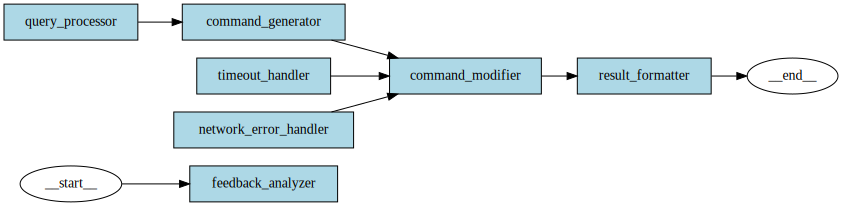

# Command Generation Design

This document describes the design of the command generation system.

## Overview

The command generation system is designed to generate shell commands based on natural language queries. It uses a LangGraph processing flow to handle the generation process.

## Architecture

The system is built as a serverless API using AWS Lambda and API Gateway. The core functionality is implemented using LangGraph, which provides a flexible and extensible framework for building AI-powered applications.

## Graph Workflow

The command generation process follows these steps:

1. **Query Generation**: The user's natural language query is used to generate a search query for the RAG system.
2. **Document Retrieval**: The search query is used to retrieve relevant documents from the vector store.
3. **Command Generation**: The processed query and retrieved documents are used to generate appropriate shell commands.

## Graph Visualization



## Components

### Models

- **GraphState**: Represents the state of the LangGraph execution, containing input fields, intermediate results, and output fields.
- **GenerateRequest**: Represents a request to generate a command.
- **GenerateResponse**: Represents a response containing the generated command.
- **GeneratedCommand**: Represents a generated shell command with an explanation.

### Nodes

- **query_generation**: Generates a search query for the RAG system based on the user's natural language query.
- **retrieve_documents**: Retrieves relevant documents from the vector store using the search query.
- **generate_commands**: Generates shell commands based on the user's query and retrieved documents.

### Core

- **generator.py**: Main function for generating commands using the LangGraph flow.

## API

The API provides a single endpoint:

- **POST /generate**: Generates a shell command based on a natural language query.

### Request Format

```json
{
  "query": "list all files in the current directory",
  "context": {
    "current_directory": "/home/user",
    "history": ["cd /home/user", "mkdir test"]
  }
}
```

### Response Format

```json
{
  "generated_command": {
    "command": "ls -la",
    "explanation": "This command lists all files in the current directory, including hidden files, with detailed information."
  }
}
```

## Configuration

The system can be configured using environment variables:

- `OPENAI_API_KEY`: OpenAI API key for language model access.
- `OPENAI_MODEL`: OpenAI model to use (default: gpt-4o).
- `EMBEDDING_MODEL`: OpenAI embedding model to use (default: text-embedding-3-small).
- `VECTOR_STORE_TYPE`: Vector store type to use (default: "chroma", options: "chroma" or "qdrant").
- `QDRANT_HOST`: Qdrant server host (default: localhost).
- `QDRANT_PORT`: Qdrant server port (default: 6333).
- `QDRANT_COLLECTION_NAME`: Qdrant collection name (default: wish).
- `LANGCHAIN_TRACING_V2`: Enable LangChain tracing (default: false).
- `LANGCHAIN_PROJECT`: LangChain project name (default: wish-command-generation-api).

## Vector Store Support

The system supports two vector store backends for document retrieval, which are installed as optional dependencies:

### ChromaDB

ChromaDB can be used for document retrieval. It stores document embeddings locally in the `~/.wish/knowledge/db` directory.

To use ChromaDB:

1. Install the package with ChromaDB support: `pip install "wish-command-generation-api[chroma]"`
2. Configure the environment variables:
   - `VECTOR_STORE_TYPE=chroma` (this is the default)

### Qdrant

Qdrant can be used as an alternative vector store backend. To use Qdrant:

1. Install the package with Qdrant support: `pip install "wish-command-generation-api[qdrant]"`
2. Configure the environment variables:
   - `VECTOR_STORE_TYPE=qdrant`
   - `QDRANT_HOST=localhost` (or your Qdrant server host)
   - `QDRANT_PORT=6333` (or your Qdrant server port)
   - `QDRANT_COLLECTION_NAME=wish` (or your collection name)

### Dependency Management

The system uses a feature-based dependency approach:

- Base installation: No vector store dependencies are included
- `[chroma]` extra: Includes ChromaDB dependencies
- `[qdrant]` extra: Includes Qdrant dependencies

If you try to use a vector store without installing its dependencies, the system will display an error message with installation instructions.
