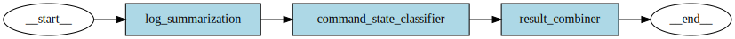

# Log Analysis Design

This document describes the design of the log analysis system.

## Graph Visualization

This graph represents the processing flow in the wish-log-analysis-api service, which includes log summarization, command state classification, and result combination.
