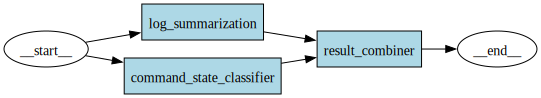

# Log Analysis Design

This document describes the design of the log analysis system.

## Client-Server Architecture

The log analysis functionality is split between two packages:

1. **wish-log-analysis (Client)**: 
   - Provides a client library (LogAnalysisClient) that sends HTTP requests to the API server
   - Handles error cases and provides fallback processing
   - Interfaces with wish-sh

2. **wish-log-analysis-api (Server)**:
   - Provides an API endpoint for analyzing command execution logs
   - Implements the LangGraph-based analysis pipeline
   - Performs log summarization and command state classification
   - Returns analysis results to the client

## Graph Visualization

This graph represents the processing flow in the wish-log-analysis-api service, which includes log summarization, command state classification, and result combination.
