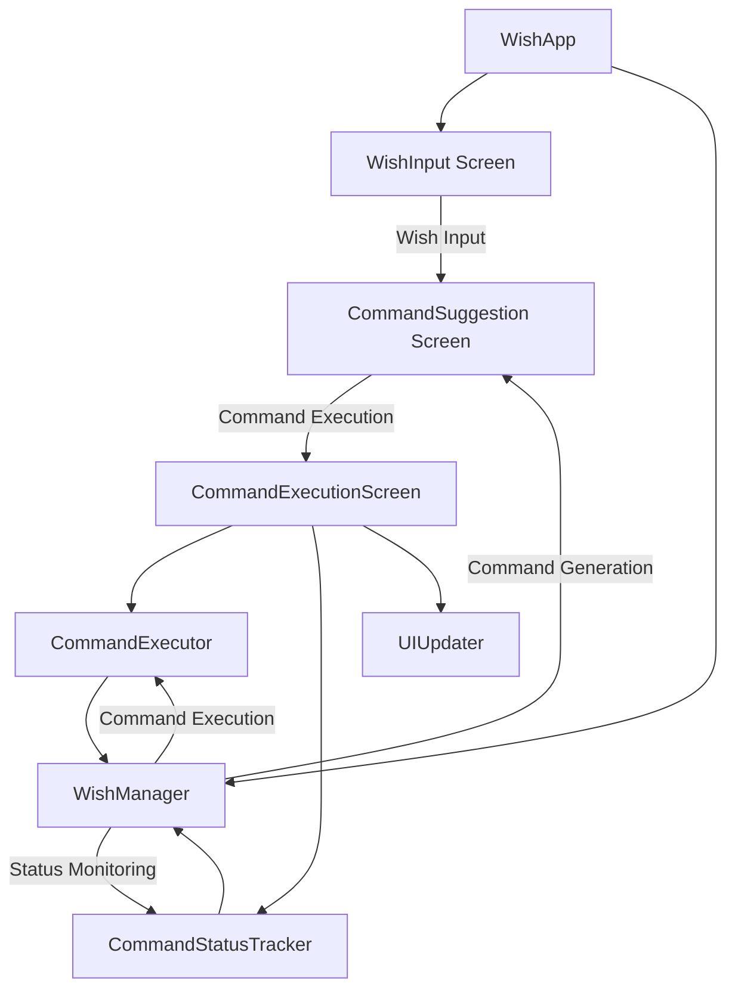

# Wish Shell TUI Design Documentation

## Overview

Wish Shell is a TUI (Text-based User Interface) application designed to assist with command-line operations. It allows users to input their "wishes" in natural language, which are then translated into executable shell commands. The application provides a user-friendly interface for reviewing suggested commands, executing them, and monitoring their execution status.

### Key Features

- **New Wish Mode**: Allows users to input wishes in natural language and receive suggested commands
- **Command Suggestion**: Displays generated commands and asks for user confirmation before execution
- **Command Execution**: Executes commands and displays real-time status updates
- **Command Status Tracking**: Monitors command execution and provides status information

## Architecture

The application follows a component-based architecture with clear separation of concerns between the UI layer and the core functionality.

### Component Diagram

### Data Flow

1. User inputs a wish in the WishInput screen
2. WishManager generates commands based on the wish text
3. CommandSuggestion screen displays the generated commands and asks for confirmation
4. If confirmed, CommandExecutionScreen uses CommandExecutor to execute the commands
5. CommandStatusTracker monitors the execution status
6. UIUpdater updates the UI with the current status
7. When all commands complete, the wish state is updated and saved to history

## TUI Implementation

The TUI is implemented using the Textual framework, which provides a rich set of widgets and layout capabilities for terminal applications.

### Screen Structure

#### WishInput Screen

The main screen where users input their wishes. It consists of:
- A header with a clock
- A prompt label ("wish✨️")
- An input field for entering the wish text
- A footer with key bindings

#### CommandSuggestion Screen

Displays the generated commands and asks for user confirmation. It includes:
- The original wish text
- A list of generated commands
- "Yes" and "No" buttons for confirmation

#### CommandExecutionScreen

Shows the execution status of each command. It includes:
- The original wish text
- A status message
- A list of commands with their execution status
- A "Back to Wish Input" button

### User Interaction

- Users input their wishes in the WishInput screen and press Enter
- The application generates commands and displays them in the CommandSuggestion screen
- Users confirm or reject the suggested commands
- If confirmed, the commands are executed and their status is displayed in the CommandExecutionScreen
- Users can return to the WishInput screen after command execution

### Styling

The application uses CSS-like styling to customize the appearance of the TUI:
- Color coding for different elements (yellow for prompts, green for success messages)
- Borders around command containers
- Consistent spacing and alignment
- Responsive layout that adapts to terminal size

## Command Execution

### Command Generation

Currently, the command generation is implemented as a mock function that returns predefined commands based on keywords in the wish text. In a future implementation, this would be replaced with an LLM-based generation system.

### Command Execution and Monitoring

Commands are executed using Python's subprocess module. The execution is non-blocking, allowing the UI to remain responsive. The application monitors the execution status of each command and updates the UI accordingly.

Key components involved:
- **CommandExecutor**: Handles the execution of commands
- **CommandStatusTracker**: Monitors the status of running commands
- **UIUpdater**: Updates the UI with the current status

### Execution Result Handling

Command execution results are captured and stored in log files. The application provides a summary of the execution results, including:
- Exit code
- Standard output (truncated if too long)
- Standard error (if any)

## Data Models

The application uses data models defined in the separate `wish-models` package. For detailed model definitions, please refer to the [wish-models repository](../wish-models).
